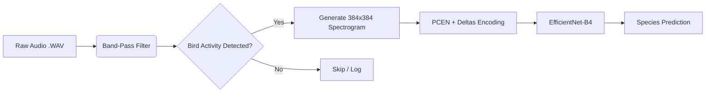

# Chirp: Bird Call Classification


---

**Chirp** is a deep learning pipeline designed to detect and classify bird species from raw audio field recordings. Unlike standard classifiers that crush audio into low-resolution images, Chirp utilizes **high-resolution 384px square spectrograms**, **PCEN adaptive gain**, and **EfficientNet-B4** architecture to capture the subtle temporal details of bird vocalizations.

The project features a modern, responsive **React frontend** that allows users to record or upload audio, visualize spectrograms, and get detailed species information.

---

## The Problem

Bird calls are complex, rapid-fire acoustic events. Traditional AI approaches often fail to capture these nuances due to three main limitations:

> **Time Distortion**
> Squishing 5 seconds of audio into a small $224 \times 224$ square blurs rapid trills.

> **Noise Training**
> Standard onset detection often captures wind, rain, or static, polluting the dataset.

> **Loss of Detail**
> Low-resolution Mel Spectrograms miss harmonic stacks crucial for species identification.

---

## The Solution: Our Methodology

### 1. The "RGB" Audio Engine

We don't just use grayscale spectrograms. We treat audio like color images to provide the model with depth and context.

| Channel | Feature | Function |
| :--- | :--- | :--- |
| **Red** | **Energy (PCEN)** | Suppresses constant background noise (wind/insects) while highlighting rapid transient events (chirps). |
| **Green** | **Velocity** | Delta features (first derivative) capturing the rate of change in energy. |
| **Blue** | **Acceleration** | Delta-Delta features (second derivative) capturing complex modulation. |

### 2. Physics-Based Segmentation

*   **Square Inputs:** We process audio in $3.0$-second chunks. At our specific sample rate and hop length, this produces a mathematically perfect $384 \times 384$ square image. This ensures **zero aspect ratio distortion** when feeding the CNN.
*   **Band-Limited Scanning:** The preprocessor ignores low-frequency rumble and high-frequency hiss, triggering only on energy in the **$1\text{kHz} - 12\text{kHz}$** "Bird Vocalization Band."
*   **Failsafe Extraction:** Includes logic to rescue faint calls from quiet recordings by analyzing the noise floor relative to local peaks.

### 3. Model Architecture

*   **Backbone:** **EfficientNet-B4** (Pretrained on ImageNet). Selected for its ability to handle higher resolution textures ($384 \times 384$).
*   **Regularization Strategy:**
    *   **MixUp:** Blends images and labels (e.g., $40\%$ Robin + $60\%$ Sparrow) to force the model to learn features rather than memorizing training data.
    *   **SpecAugment:** Randomly masks vertical (time) and horizontal (frequency) strips during training to improve robustness against signal loss.
    *   **Label Smoothing:** Prevents the model from becoming over-confident in its predictions.

---

## Interactive Frontend

The application includes a rich web interface built with **React**, **Tailwind CSS**, and **Framer Motion**.

### Key Features

| Feature | Description |
| :--- | :--- |
| **Audio Input** | Drag-and-drop file upload or record directly from your microphone. |
| **Waveform Editor** | Visual editor to trim and select the exact audio segment for analysis. |
| **Classification Card** | Shows the predicted species, confidence score, and top alternative matches. |
| **Species Info Window** | Displays detailed facts about the bird, including native range, habitat, diet, and vocalization descriptions. |
| **Spectrogram View** | A dedicated full-width view of the generated spectrogram used by the AI, allowing you to "see" the sound. |

---

## Visual Pipeline



---

## Getting Started

Chirp is fully containerized. Whether you are developing features or deploying the model, we use Docker to manage the React frontend, FastAPI backend, and dependencies.

### Prerequisites

*   Docker Desktop installed and running.
*   Git

### 1. Clone the Repository

```bash
git clone https://github.com/benpratkanis/Chirp-Bird-Classifier.git
cd chirp
```

### 2. Run in Development Mode

Use this mode for active coding. It enables Hot Module Replacement (HMR) for the React frontend and auto-reloading for the FastAPI backend.

**Start the stack:**

```bash
docker-compose up --build
```

**Access the application:**

*   **Frontend (Vite):** `http://localhost:5173`
*   **Backend Docs (Swagger UI):** `http://localhost:8000/docs`

**Hybrid Mode (Faster Frontend Dev):**
If you want faster frontend iteration without rebuilding containers:
1.  Run `docker-compose up backend` (starts only the API).
2.  In a new terminal, `cd frontend` and run `npm install` then `npm run dev`.
3.  The frontend will run locally at `http://localhost:5173` and proxy API requests to the Docker backend.

**Stop the stack:**
Press `Ctrl+C` in your terminal.

### 3. Run in Production Mode

Use this mode to simulate the final deployment environment. This uses `docker-compose.prod.yml` to serve the frontend via Nginx and runs the backend with production workers.

**Architecture:**
*   **Frontend Container (Port 3000):** Nginx serving React static files.
*   **Backend Container (Port 8000):** FastAPI with Uvicorn.
*   **Reverse Proxy (Host Nginx):** Your server's main Nginx should proxy requests:
    *   `/api/*` -> `localhost:8000`
    *   `/*` -> `localhost:3000`

**Deploying on Low-Memory Servers (e.g., AWS t2.micro):**
To prevent freezing during build, use the provided deployment script:

```bash
chmod +x deploy.sh
./deploy.sh
```

**Manual Production Run:**
```bash
docker-compose -f docker-compose.prod.yml up --build -d
```

**Access the application:**
*   **Frontend:** `http://localhost:3000` (Direct container access)
*   **Backend:** `http://localhost:8000`

**Stop and remove containers:**
```bash
docker-compose -f docker-compose.prod.yml down
```

---
